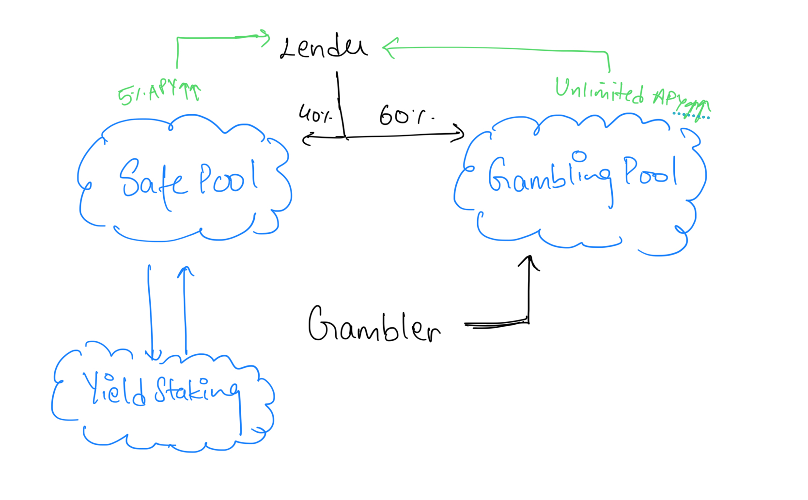

# Ludi Finance


> TL;DR: Ludi Finance is a decentralized finance (DeFi) protocol built on the Fuel blockchain. It allows users to stake their tokens, participate in gambling, and earn rewards. Remember the House always wins. You are the house! Stake, Gamble and Earn!


**Ludi Finance** is an first in its kind DeFi protocol that merges the worlds of lending and gambling into a dynamic ecosystem. Inspired by the ancient Roman concept of public games and entertainment (ludi), the platform allows users to engage in both secure and high-risk financial activities. Ludi Finance provides an opportunity for users to earn stable returns on their assets while participating in higher-stakes gambling to expand the pool of money, combining the thrill of chance with the security of decentralized finance.

## How Ludi Finance Works

Ludi Finance operates with three distinct pools to manage the varying risk appetites of its users: the **Safe Pool**, the **Risk Pool**, and the **Gambling Pool**. Each pool serves a specific purpose and caters to different user profiles: lenders seeking stability, risk-takers looking for higher returns, and gamblers eager to expand the ecosystem through chance.

### 1. The Safe Pool
The **Safe Pool** is designed for users (lenders) who seek low-risk opportunities with stable, predictable returns. Lenders deposit assets into this pool and receive a fixed APY (Annual Percentage Yield) on their deposits. These funds are primarily used to generate returns through yield farming or other DeFi strategies that ensure the pool remains solvent and profitable, mitigating significant risk exposure. The Safe Pool guarantees a minimum return on investment, making it an attractive option for more conservative lenders.

### 2. The Gambling Pool
The **Gambling Pool** is where the high-stakes action happens. Gamblers place bets using their assets, and the outcome of these bets directly impacts the ecosystem. If they win, a portion of their winnings flows into the Risk Pool and, to a lesser extent, the Safe Pool, thereby benefitting lenders. If they lose, their assets remain in the Gambling Pool, expanding the total available funds. The Gambling Pool is capped to prevent total depletion of the ecosystem, ensuring that losses don’t overwhelm the entire platform.




## User Roles and Interactions

### Lender:
- **Deposit Funds**: Lenders can deposit assets into the Safe Pool, where they receive a stable APY.
- **Risk-Adjusted Returns**: If they wish to increase their returns, they can transfer their funds into the Risk Pool, where the potential gains are higher due to its connection with the Gambling Pool.
- **Stability & Risk**: Lenders in the Safe Pool enjoy guaranteed returns, while those in the Risk Pool take on additional risk for potentially higher rewards.

### Gambler:
- **Place Bets**: Gamblers use the funds in the Gambling Pool to participate in various games of chance. Their bets fuel the ecosystem, providing returns to the Risk Pool and, indirectly, the Safe Pool.
- **Win & Loss Dynamics**: If gamblers win, they take a portion of their earnings, while another portion flows back into the lending pools. Losses add to the Gambling Pool, creating opportunities for others.

### Platform:
- **Capital Flow Management**: Ludi Finance ensures smooth capital flow between the Safe, Risk, and Gambling Pools, maintaining balance across the ecosystem.
- **Sustainability**: The platform implements strict caps on the Gambling Pool to avoid catastrophic losses and ensure long-term sustainability.
- **Liquidity & Yield**: The platform uses proven DeFi strategies, such as yield farming, staking, and other mechanisms to grow the value in the Safe and Risk Pools.

## $LUDI Token and Bonding Curve Model
The platform operates with its native token, **$LUDI**, which powers transactions and rewards across the ecosystem. The token follows a **bonding curve model**, dynamically adjusting its price based on demand and supply. This model ensures that early adopters benefit from lower token prices, while the increasing token supply drives higher prices.

- **Token Issuance**: Users receive $LUDI tokens in exchange for their assets, which can be used to interact with different pools.
- **Bonding Curve**: The price of $LUDI tokens follows a predetermined curve, rising as more tokens are minted. This incentivizes early participation and provides price stability over time.
- **Staking**: Users can stake their $LUDI tokens to earn additional rewards, fostering long-term engagement.

## Gambling Pool Caps and Safety Mechanisms
To prevent the complete depletion of funds in the Gambling Pool, Ludi Finance implements caps on the amount of money that can be lost by gamblers at any given time. This ensures that the pool remains solvent, even during periods of heavy losses. Additionally, these caps protect the Risk Pool and Safe Pool from being severely impacted by extreme gambling outcomes.

- **Gambling Pool Cap**: Limits the total amount of funds that can be risked, preserving liquidity for future use.
- **APY Protection**: Ensures that the Safe Pool maintains its guaranteed APY, even in high-volatility scenarios.

## Simplicity vs. Complexity
While Ludi Finance incorporates innovative DeFi mechanisms, it also strives for simplicity in user interaction. The use of a bonding curve model for $LUDI tokens and the interplay of three distinct pools are designed to be intuitive, with clear risk-reward structures. Lenders and gamblers alike can easily understand the dynamics of their potential returns or losses.

## Conclusion
Ludi Finance offers a unique blend of decentralized finance and gambling, catering to a broad spectrum of users—from those seeking stable returns to high-risk gamblers chasing bigger rewards. With its three-pool system, $LUDI token, and bonding curve model, the platform ensures a balanced ecosystem where both lenders and gamblers can profit while maintaining sustainability. By merging ancient concepts of gaming with modern financial technology, Ludi Finance opens up new possibilities for engaging with DeFi and luck-based investments.

# Technologies Used

- Orao VRF for transparent and secure random number generation.
- Fuel smart contracts for secure and decentralized financial operations.
- Vite and Tailwind CSS for the frontend.

# Testnet Contract Address

> 0x8a5760e34f003be492c69264324d41f5cea1579199b09951b4c016245ee59baa

## Buisness Model

1. Charge a certain percentage for every win from the gamblers.
2. Charge a certain percentage for every deposit from the stakers/lenders.


You can also view the contract on the Fuel Explorer [here](https://explorer.fuel.network/contracts/0x8a5760e34f003be492c69264324d41f5cea1579199b09951b4c016245ee59baa).

This is a [Vite](https://vitejs.dev/) project bootstrapped with [`create-fuels`](https://github.com/FuelLabs/fuels-ts/tree/master/packages/create-fuels).

## Getting Started

1. Start the Fuel development server. This server will start a local Fuel node and provide hot-reloading for your smart contracts.

```bash
npm run fuels:dev
```

2. Start the Next.js development server.

```bash
npm run dev
```

## Deploying to Testnet

To learn how to deploy your Fuel dApp to the testnet, you can follow our [Deploying to Testnet](https://docs.fuel.network/docs/fuels-ts/creating-a-fuel-dapp/deploying-a-dapp-to-testnet/) guide.

## Learn More

- [Fuel TS SDK docs](https://docs.fuel.network/docs/fuels-ts/)
- [Fuel Docs Portal](https://docs.fuel.network/)
